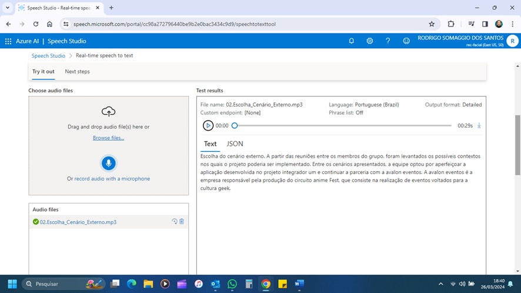
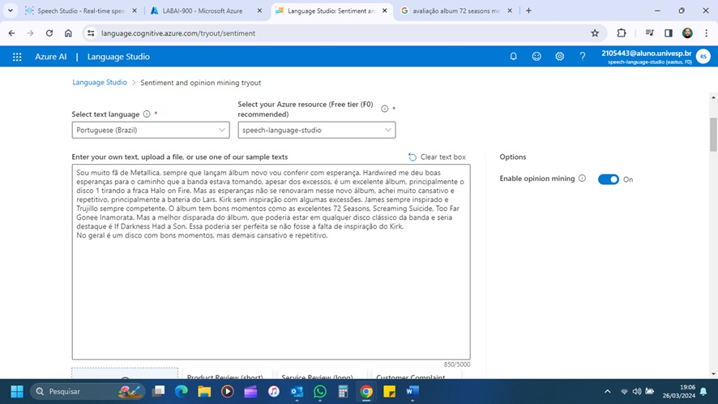
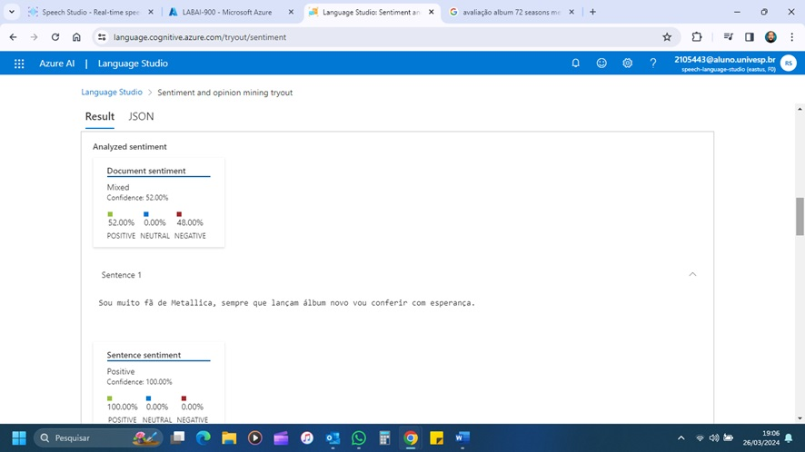
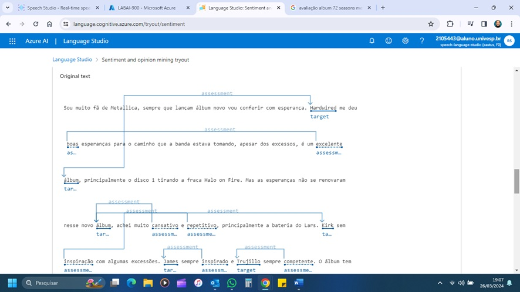

# Análise de Sentimento com Language Studio no Azure Artificial Intelligence
O Lab foi direcionado ao conhecimento das ferramentas Speech e Language Studio.  

Através destas ferramentas, podemos utilzar recursos de Inteligência Artificial para converter fala em texto e analisar sentimentos contidos em texto.  

Abaixo estão alguns exemplos:  

  
Exemplo de conversão de texto em fala.

  
01. Exemplo de analise de sentimento contido no texto.

  
02. Exemplo de analise de sentimento contido no texto.

  
03. Exemplo de analise de sentimento contido no texto.
